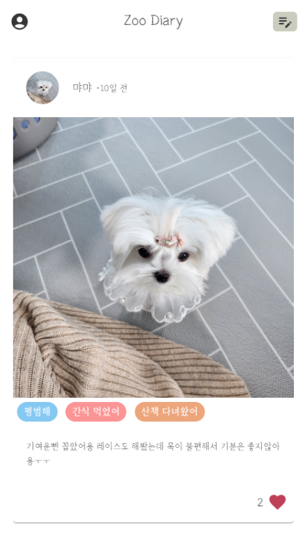
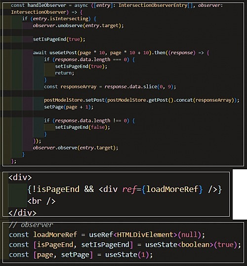
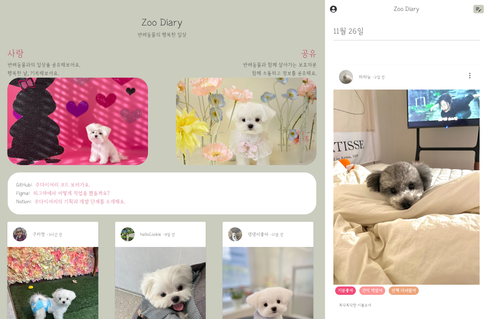
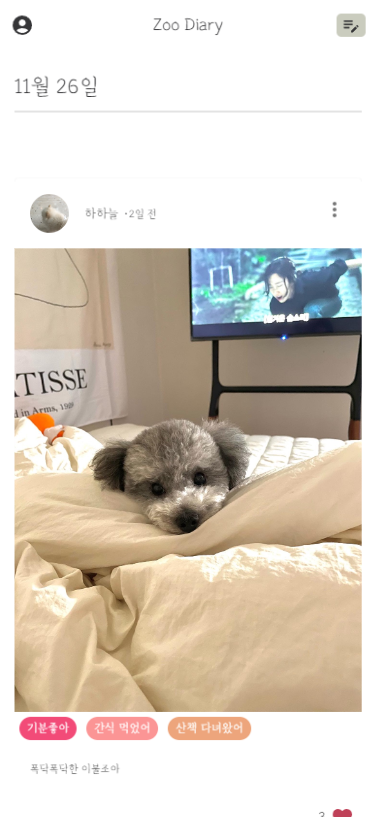

# ZooDiary

반려동물의 일상을 기록하고 공유할 수 있습니다. 서로의 일상에 공감해보세요.



## Requirement
```
typescript, react, vite, ESLint, prettier, commitLint, husky, stackflow, mui, swagger, zustand, emotion, pwa

```

## How to run? 
```bash
yarn
yarn dev

// production
yarn start
```
zoodiary-back(https://github.com/devxian96/ZooDiary-Back)
위 프로젝트는 백엔드 프로젝트로, zoodiary 레포와 함께 실행해야합니다.


## Project structure
```
📦src
 ┣ 📂activities // 스택플로우 웹뷰
 ┣ 📂assets // 미디어 파일
 ┣ 📂components // 컴포넌트
 ┣ 📂constants // 상수 (데이터)
 ┣ 📂hooks // 커스텀 훅 (액션)
 ┣ 📂stores // 익스터널 스토어
 ┣ 📂utils // 유틸 (계산)
 ┣ 📜main.tsx
 ┣ 📜stackflow.ts
 ┗ 📜vite-env.d.ts
```

## Commit rule
```
feat        새로운 기능을 제공합니다.
fix         버그 수정.
docs        문서만 변경됩니다.
style       코드 작동에 영향을 미치지 않는 스타일 변경(빈 공간, 코드 포멧팅, 누락된 세미콜론 등)
refactor    버그를 수정하거나 기능을 추가하지 않는 코드 변경입니다.
test        테스트 코드를 추가하거나 기존 테스트 코드를 수정합니다.
chore       빌드 프로세스 또는 보조 도구 및 라이브러리(예: 문서 생성)에 대한 변경 사항.
perf        성능을 향상시키는 코드 변경입니다.
ci          CI 구성 파일 및 스크립트의 변경 사항.
build       빌드 시스템 또는 외부 디펜던시에 영향을 미치는 변경 사항(예: gulp, brocoli, npm).
temp        변경사항에 포함되지 않는 임시 커밋입니다.
```

## Project Detail
- `infinity scroll` : observer를 사용하여 스크롤 이벤트를 감지하고 자동으로 새로운 데이터를 로드할 수 있습니다. 담벼락의 게시글들을 공유 할 때 인피니티 스크롤을 적용한 이유는 사용자 경험을 향상시키고 성능을 최적화하기 위해서 사용 하였습니다.


- `StackFlow` : React Router DOM과 유사한 사용성을 갖추어, 모바일 앱과 유사한 사용자 경험을 위해 도입되었습니다.

- `Cross Web Design` : 앱과 비슷한 사용성을 위해 적용하였고, 이는 다양한 디바이스에 최적화된 사용자 경험을 제공하기 위한 조치로, 웹에서는 더 큰 화면을 활용하여 부가적인 정보를 시각적으로 제공하고, 모바일에서는 화면 크기를 고려하여 간결한 레이아웃을 유지하여 사용자들에게 효과적이고 일관된 디자인을 제공하기 위하여 사용했습니다.
- `Web`


- `Mobile`



## Project Management

이 프로젝트는 [notion](https://gaudy-baryonyx-7e4.notion.site/Zoo-Diary-8ae3a505ff5c47dabbd326e271dc2e29?pvs=4)으로 관리했어요.

디자인은 간단하게 [figma](https://www.figma.com/file/R3RnoAUBlLY1ASy45ME2C8/Zoo-Diary?type=design&t=llIylrRRAeyoubU2-6) 로 제작했어요.
